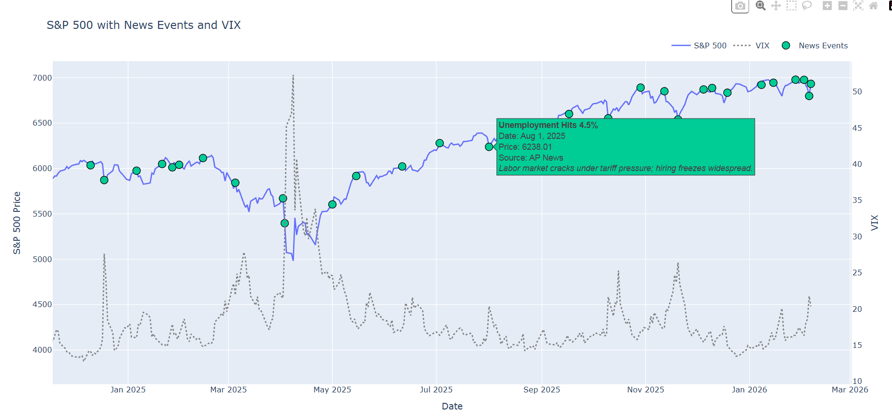

# how-markets-react

This project is a Python-based market analysis tool that combines financial data, news events, and macroeconomic indicators to visualize how markets react to news and economic updates. 

The goal: to better understand the drivers of market movements, including sentiment, monetary policy, geopolitical events, and corporate earnings.

# Features

- **Market Data**: Fetches historical and recent market data from Yahoo Finance (S&P 500, VIX, and other assets like oil or ETFs can be added).
- **News Events**: Loads financial and macroeconomic news from CSV (sample included). News markers are aligned to the nearest trading day.
- **Interactive Visualization**: Plots market prices alongside news events using Plotly. Hover over markers to see headlines, sources, and descriptions.
- **Insights**: Helps analyze market reactions to:
  - Monetary policy (Fed interest rate changes, FOMC announcements)
  - Geopolitical events and shocks
  - Government data releases (jobs, CPI, GDP, debt)
  - Corporate earnings and guidance

# Notes

The news.csv included is just a sample demonstration. You can replace it with your own curated news.

# Personal Context

I run a micro hedge fund to manage my personal and family's savings. When I started investing a year ago, I was not fully aware of what drove market movements. 

By building this model I have developed stronger understanding of how global markets move and how do different events like geopolitical tensions or sentiment affects stock prices.

Using this model, my fund has significantly outperformed S&P500 in the year 2025.

This project is a work in progress, and future improvements will focus on providing better decision-making tools to maximize returns and outperform benchmark indices.

# Future Improvements

- Categorize news and assign different colors to markers for better visual analysis. (geopolitics / shocks, monetary policy, government data, corporate earnings, etc)
- Include additional charts of different ETFs, commodities, and global indices.
- Overlay central bank interest rates to analyze market reaction to monetary policy better.

# Here are examples of the interactive chart:

1.

2. Zoomed to Jan 2025 to Feb 2026 Period. Hovered over Aug 1, 2025 which shows one of the headlines from AP news.

3.

